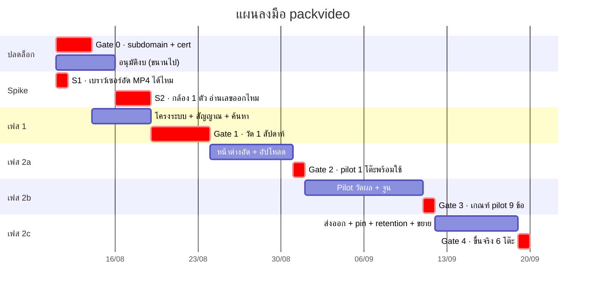
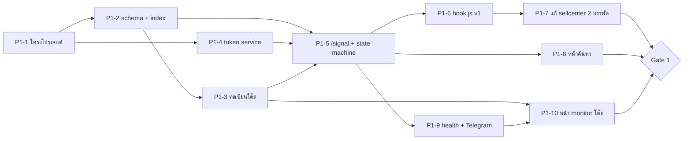
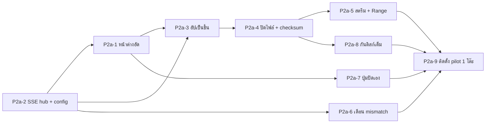
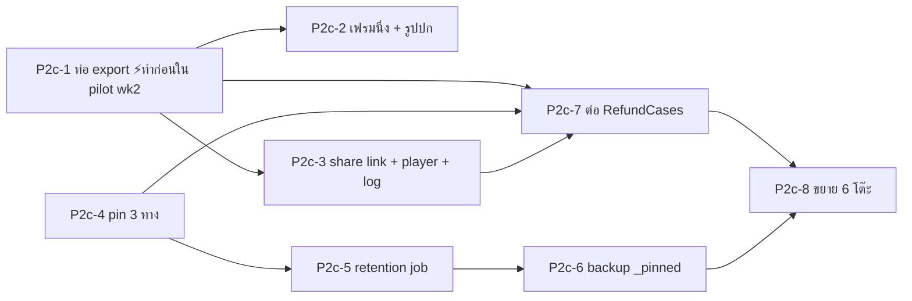

# Packing Video — แผนลงมือ (Implementation Workflow)

| | |
|---|---|
| สถานะ | ร่าง 1 — รอทบทวน |
| วันที่ | 2026-08-08 |
| ต้นทาง | [design.md](../docs/design.md) · [requirements.md](../docs/requirements.md) |
| ระยะเวลา | ~5 สัปดาห์ (dev ~19 วันทำงาน + pilot ที่ไม่ใช่ dev เต็มเวลา) |
| เอกสารนี้ไม่รวม | โค้ดจริง → `/sc:implement` |

---

## 0. หลักการของแผนนี้

| # | หลักการ | ผล |
|---|---|---|
| 1 | **เอาความไม่แน่ใจขึ้นหน้า** | 2 spike ในวันแรก ก่อนเขียนโค้ดจริงและก่อนใช้เงิน |
| 2 | **เฟส 1 ไม่รออนุมัติงบ** | เฟส 1 ไม่ต้องใช้กล้องสักตัว เริ่มได้ทันทีที่มี subdomain |
| 3 | **ซื้อกล้อง 1 ตัวก่อน ไม่ใช่ 6** | ถ้ารุ่นที่เลือกโฟกัสไม่ดี เสีย 3,000 ไม่ใช่ 18,000 |
| 4 | **ทุกเฟสจบด้วยด่านที่ผ่าน/ไม่ผ่านชัดเจน** | ไม่มีการ "ทำต่อไปก่อนแล้วค่อยดู" |
| 5 | **ของที่แก้ยากทำก่อน** | แก้ sellcenter (Node 12) ครั้งเดียวจบในเฟส 1 |

### ภาพรวม

---

## 1. Gate 0 — สิ่งที่ต้องปิดก่อนเริ่มเขียนโค้ด

| # | เรื่อง | ใครทำ | บล็อกอะไร | จำเป็นแค่ไหน |
|---|---|---|---|---|
| G0-1 | subdomain + SSL cert | IT | **ทั้งเฟส 1** | ⛔ บล็อกแข็ง |
| G0-2 | ยืนยันเส้นทางเครือข่ายว่าไม่อ้อมออกเน็ต | IT | ไม่บล็อก แต่ต้องรู้ก่อนเฟส 2b | ⚠️ |
| G0-3 | อนุมัติงบ ~24,000 | ผู้บริหาร | เฉพาะการซื้อกล้อง (S2, เฟส 2a) | ⛔ บล็อกฮาร์ดแวร์ |
| G0-4 | อนุมัติขั้นตอนใหม่ของพนักงาน (+1 สแกน) | หัวหน้าคลัง | เฟส 2b | ⚠️ |
| G0-5 | ข้อความป้าย PDPA ครอบคลุมการเปิดเผยต่อภายนอก | HR/กฎหมาย | เฉพาะฟีเจอร์ share link ในเฟส 2c | ⚠️ |

> **G0-1 คือตัวเดียวที่บล็อกการเริ่มงาน** เพราะ `digital.in.th` เป็น https การยิง `sendBeacon`
> ไปยัง http จะถูกเบราว์เซอร์บล็อกเป็น mixed content — เฟส 1 จึงต้องมี cert ตั้งแต่ต้น
> ไม่ใช่รอถึงตอนใช้กล้อง (`getUserMedia`)

**สิ่งที่ยังไม่ต้องตอบตอนนี้** (ตกลงกันแล้วว่าทำทีหลัง): งาน auto-pin จากขนส่ง · อายุลิงก์แชร์ปริยาย · ค่า bitrate สุดท้าย

---

## 2. Spike — ทำก่อนทุกอย่าง

### S1 · เบราว์เซอร์ที่โต๊ะแพ็คอัด MP4 ได้ไหม (½ วัน · ไม่มี dependency)

ตรวจ D2 ซึ่งเป็นสมมติฐานที่ถือน้ำหนักมากที่สุดในสถาปัตยกรรม

**ทำอะไร:** หน้าเว็บหน้าเดียวบน localhost ที่เรียก `MediaRecorder.isTypeSupported()` กับ 3 ฟอร์แมต
แล้วลองอัดจริง 30 วินาที เปิดไฟล์ที่ได้ด้วย VLC และ ffprobe

**เกณฑ์ผ่าน:** `video/mp4;codecs=avc1.42E01E` รองรับ และไฟล์ที่ได้เปิดได้ + ต่อชิ้นได้

| ผล | ผลต่อแผน |
|---|---|
| ✅ ผ่าน | เดินตามแผนนี้ทั้งหมด |
| ❌ ไม่ผ่าน | ต้องเพิ่มงาน "คิวแปลงไฟล์กลางคืน" เข้าเฟส 2a (+2 วัน) และทบทวน CPU ของเครื่องเซิร์ฟเวอร์ |

> ทำได้บน localhost เพราะเป็น secure context — **ไม่ต้องรอ G0-1 และไม่ต้องรออนุมัติงบ**
> ทำวันแรกได้เลย และเป็นงานครึ่งวันที่ตัดความเสี่ยงหลายวันออกไป

### S2 · กล้อง 1 ตัว อ่านเลขพัสดุออกที่ bitrate ต่ำไหม (2–3 วัน · รอ G0-3)

ตรวจ NFR-2.2 กับ FR-7.1 ซึ่งเป็นคู่ที่ขัดกันเอง — ลด bitrate เพื่อเก็บ 30 วัน แต่ต้องยังอ่านเลขออก

**ทำอะไร**
1. ซื้อกล้อง autofocus **1 ตัว** + ขาจับ 1 ชุด (~3,500 บาท)
2. ตั้งคร่อมโต๊ะจริงที่ระยะ 60–80 ซม.
3. อัดใบปะหน้าจริง 20 ใบ (คละขนส่ง คละคุณภาพการพิมพ์) ที่ 0.8 / 1.0 / 1.2 / 1.5 Mbps
4. ให้คน 2 คนที่ **ไม่รู้เลขล่วงหน้า** อ่านเลขจากคลิป
5. ทดสอบทั้งตอนกลางวันและตอนเปิดไฟ LED

**เกณฑ์ผ่าน:** มี bitrate อย่างน้อยหนึ่งค่าที่ ≤1.2 Mbps และอ่านออก 20/20 ทั้งสองคน

| ผล | ผลต่อแผน |
|---|---|
| ✅ ผ่าน | ล็อกค่า bitrate → ซื้อกล้องที่เหลืออีก 5 ตัว |
| ⚠️ ต้องใช้ >1.2 Mbps | กลับไปทบทวน retention 30 วัน (requirements NFR-2.3) ก่อนซื้อเพิ่ม |
| ❌ อ่านไม่ออกทุกค่า | ปัญหาอยู่ที่กล้อง/แสง ไม่ใช่ bitrate — เปลี่ยนรุ่นกล้องแล้วทดสอบใหม่ **ยังไม่เสียเงิน 18,000** |

> **นี่คือเหตุผลที่ซื้อ 1 ตัวก่อน** — ถ้ารุ่นที่เลือกโฟกัสไม่ดีพอ ค่าเสียหายคือ 3,500 บาท
> ไม่ใช่ 21,000 บาท และรู้ตั้งแต่สัปดาห์แรก ไม่ใช่ตอนติดตั้ง 6 โต๊ะแล้ว

---

## 3. เฟส 1 — โครงระบบและสัญญาณ (5 วัน)

**เป้าหมาย:** ระบบรู้ว่าออเดอร์ไหนแพ็คที่โต๊ะไหนโดยใคร **โดยยังไม่มีกล้องสักตัว**
พิสูจน์ D1 (hook เกาะติดจริงไหม) และ D6 (ตัวหาร health ถูกไหม) ด้วยข้อมูลจริงก่อนใช้เงิน

| # | งาน | วัน | ขึ้นกับ | เสร็จเมื่อ (DoD) |
|---|---|---|---|---|
| **P1-1** | โครงโปรเจกต์ Node 22 · Dockerfile · compose · nginx vhost · `/api/health` | 1 | G0-1 | เปิด `https://packvideo…/api/health` จากเครื่องโต๊ะแพ็คได้ |
| **P1-2** | MongoDB db `packvideo` · collection `clips` `clip_events` `stations` `share_links` + index ทั้ง 6 ตัวตาม design §6.1 | 0.5 | P1-1 | `explain()` ยืนยันว่าค้นด้วย ordersn/tracking/imei ใช้ index |
| **P1-3** | ทะเบียนโต๊ะ + หน้าตั้งค่า `station_id` + กัน id ซ้ำ | 0.5 | P1-2 | ตั้ง 2 เครื่องเป็น `desk-03` เหมือนกัน → เครื่องที่สองถูกปฏิเสธพร้อมบอกว่าชนกับเครื่องไหน |
| **P1-4** | Token service ล้อ pattern `ServiceTokenService` — generate/rotate/revoke + `scopes[]` | 0.5 | P1-1 | station token เรียก endpoint ที่ไม่ใช่ scope ตัวเอง → 403 |
| **P1-5** | `POST /signal` + state machine ครบ 5 เหตุการณ์ + แมป `trace_id → clip_id` + ตรรกะแยก IMEI/tracking | 1.5 | P1-2 P1-3 P1-4 | ยิงสัญญาณครบชุดด้วย curl → ได้ clip ที่มีสถานะถูกต้องทุกเส้นทางใน design §3.1 · **ตอบ 204 เสมอ ไม่เคยตอบ 4xx/5xx** |
| **P1-6** | `hook.js` v1 — ชั้น ajax + ชั้น keydown + กันซ้ำด้วย `trace_id` | 1 | P1-5 | เปิดหน้า `/shopee/imei` จริง สแกน 20 ครั้ง → ได้สัญญาณครบ 20 ไม่ซ้ำไม่ขาด · console หน้าแพ็คไม่มี error เพิ่ม |
| **P1-7** | แก้ sellcenter: เพิ่ม `<script async>` 2 ไฟล์ + deploy | 0.5 | P1-6 | ขึ้น production แล้วหน้าแพ็คทำงานเหมือนเดิมทุกอย่าง |
| **P1-8** | หน้าค้นหา — ค้นด้วย ordersn / tracking / imei / ช่วงวัน / โต๊ะ / คน (ยังไม่มีวิดีโอ แสดง timeline เหตุการณ์) | 1 | P1-5 | ค้นออเดอร์ที่แพ็คไปเมื่อเช้าแล้วเห็นว่าโต๊ะไหน ใครแพ็ค กี่โมง |
| **P1-9** | Health monitor 4 ตัวชี้วัด + แจ้ง Telegram (**อ่าน token จาก env**) | 0.5 | P1-5 | ปิด hook ทิ้ง → ได้ Telegram ภายใน 15 นาที |
| **P1-10** | หน้า monitor สถานะโต๊ะ | 0.5 | P1-3 P1-9 | เห็นทุกโต๊ะพร้อมสถานะในหน้าเดียว |

**รวม 7.5 วัน-คน · ~5 วันปฏิทิน** ถ้าทำงานขนานกันได้บ้าง

### ⚠️ P1-7 คือจุดเสี่ยงที่สุดของเฟสนี้

เป็นการแตะ sellcenter ครั้งเดียวในทั้งโครงการ (Node 12 + `archive.debian.org`) ต้อง:
- deploy นอกเวลาแพ็คของ
- เตรียมวิธี rollback ไว้ล่วงหน้า — เอา script tag ออกแล้ว deploy กลับ
- ยืนยันว่า `async` อยู่จริงทั้ง 2 ไฟล์ ก่อน deploy

---

## 4. Gate 1 — วัดของจริง 1 สัปดาห์ (ยังไม่มีกล้อง)

รันเฟส 1 บน production ทั้ง 6 โต๊ะ 5 วันทำการ แล้วดูตัวเลข

| # | เกณฑ์ | ผ่านเมื่อ | ถ้าไม่ผ่าน |
|---|---|---|---|
| **A1** | อัตราสัญญาณ `commit` ต่อ `tag` | ≥ 0.98 | D1 ผิด → ทบทวนจุดเกาะของ hook ก่อนไปต่อ |
| **A2** | ครั้งที่หน้าแพ็คช้าลง/ค้าง | 0 | ถอน script tag ทันที แล้วหาสาเหตุ |
| **A3** | ออเดอร์ที่พิมพ์ใบปะหน้าแล้วไม่มีสัญญาณ | ≤ 2% | ตรวจว่ามีทางเข้าอื่นนอก `/shopee/imei` (สมมติฐาน S1 ใน requirements ผิด) |
| **A4** | ตรรกะแยก IMEI/tracking ตัดสินถูก | ≥ 99% | ปรับตรรกะ — แก้ที่ packvideo อย่างเดียว ไม่ต้อง deploy sellcenter |
| **A5** | โต๊ะที่ตั้ง `station_id` ครบ | 6/6 | ตามเก็บ |

> **นี่คือด่านที่คุ้มที่สุดในทั้งโครงการ** — ได้คำตอบว่า hook เกาะติดจริงไหมและระบบเดิม
> รับได้ไหม โดยยังไม่ได้ใช้เงินกล้องสักบาท ถ้า A1 หรือ A2 ไม่ผ่าน ต้องหยุดแก้ก่อน
> ไม่ใช่เดินหน้าต่อ

**ระหว่างรอ 5 วันนี้ ทีม dev ไม่ว่าง** — เริ่ม P2a-1 และ P2a-2 คู่ขนานได้เลย เพราะไม่ขึ้นกับผล Gate 1

---

## 5. เฟส 2a — หน้าต่างอัดและการอัปโหลด (7 วัน)

| # | งาน | วัน | เสร็จเมื่อ (DoD) |
|---|---|---|---|
| **P2a-1** | หน้าต่างอัด — `getUserMedia` · เลือกกล้อง · พรีวิว · Wake Lock · ไม่มีลิงก์ที่ navigate ออก · `beforeunload` | 1.5 | เปิดค้าง 8 ชม. หน่วยความจำไม่โต · จอไม่ดับ |
| **P2a-2** | SSE hub ต่อ station + `ping` ทุก 20 วิ + เหตุการณ์ `config` | 1 | ถอดสายแลน 2 นาทีแล้วเสียบกลับ → ต่อใหม่เองไม่ต้องรีเฟรช |
| **P2a-3** | อัปโหลดเป็นชิ้น timeslice 5 วิ + คิว IndexedDB + `PUT` idempotent ตาม `seq` | 2 | ตัดเน็ต 10 นาทีระหว่างอัด → เปิดเน็ตแล้วคลิปครบ ไม่มีชิ้นซ้ำ ไม่มีชิ้นขาด |
| **P2a-4** | ปิดไฟล์ · checksum · เขียน JSON คู่ · ย้ายจาก `_tmp` เข้าโฟลเดอร์วัน | 0.5 | ไฟล์เปิดด้วย VLC ได้ · `ffprobe` บอกความยาวตรงกับ `duration_ms` |
| **P2a-5** | สตรีมสื่อ + signed URL + รองรับ Range → 206 | 1 | เลื่อนไปนาทีที่ 1 ของคลิปได้โดยไม่ต้องโหลดทั้งไฟล์ |
| **P2a-6** | เตือน mismatch — เต็มจอ + **มีเสียง** + คลิปอัดต่อ | 0.5 | สแกนใบปะหน้าของออเดอร์อื่น → เตือนภายใน 1 วิ · คลิปไม่ปิด |
| **P2a-7** | ปุ่มปิดเอง — กดค้าง 1 วิ → `manual_stop` | 0.5 | สถานะแยกจาก `unverified` ในรายงาน |
| **P2a-8** | กันดิสก์เต็ม 75/85/90 + `config {recording:false}` | 0.5 | จำลองดิสก์ 91% → หยุดอัด ขึ้นแดง **แต่ `/signal` ยังรับ 204 ปกติ** |
| **P2a-9** | ติดตั้ง pilot 1 โต๊ะ — กล้อง ขาจับ ไฟ + อบรมพนักงาน 1 คน | 0.5 | พนักงานแพ็คได้เอง 10 ออเดอร์ติดโดยไม่ต้องถาม |

**รวม 8 วัน-คน · ~7 วันปฏิทิน**

### Gate 2 — พร้อมเปิด pilot

- [ ] อัดครบ 20 ออเดอร์ติดโดยไม่มีคลิปหาย
- [ ] ปิดหน้าต่างอัดกลางคัน → คลิปค้างถูกปิดเป็น `unverified` ไม่ค้างเป็น `.part`
- [ ] ดิสก์เต็มจำลอง → งานแพ็คไม่สะดุด
- [ ] เปิดคลิปย้อนหลังจากหน้าค้นหาได้ เลื่อนกลางคลิปได้

---

## 6. เฟส 2b — Pilot 1 โต๊ะ 2 สัปดาห์ (ไม่ใช่ dev เต็มเวลา)

**งานหลักคือวัดผลและจูน ไม่ใช่เขียนโค้ด** — กัน dev ไว้ ~30% สำหรับแก้ที่เจอหน้างาน

| สัปดาห์ | ทำอะไร |
|---|---|
| 1 | รันจริง เก็บตัวเลขทุกวัน ปรับมุมกล้อง/ไฟ/ตำแหน่งขาจับ · ฟัง feedback พนักงาน |
| 2 | ล็อกค่า bitrate จากข้อมูลจริง · ทดสอบ export กับเคสจริง ≥10 เคส · เก็บ p50/p95 ความยาวคลิป |

### ตัวเลขที่ต้องเก็บ

| ตัวชี้วัด | ใช้ตัดสินอะไร |
|---|---|
| p50 / p90 / p99 ความยาวคลิป | ยืนยัน NFR-2 — ถ้า p95 > 90 วิ ต้องคุยเรื่องขั้นตอนหน้างาน ไม่ใช่แก้ระบบ |
| ขนาดเฉลี่ยต่อคลิป | ต้อง ≤ 13 MB ไม่งั้น retention 30 วันไม่รอด |
| % `verified` · % `manual_stop` | `manual_stop` สูง = ปัญหาเครื่องพิมพ์ ไม่ใช่ปัญหาระบบ |
| จำนวนครั้งที่เตือน mismatch | ประเมินมูลค่าเป้าหมาย G3 |
| ปริมาณข้อมูลบนเครือข่ายจริง | ปิดคำถาม G0-2 |
| เวลาที่เพิ่มต่อออเดอร์ | ต้อง ≤ 3 วิ ที่ p95 |

### Gate 3 — เกณฑ์ pilot 9 ข้อ

ต้องผ่าน**ทุกข้อ** ตาม [requirements §6](../docs/requirements.md) จึงขยาย 6 โต๊ะ

| | เกณฑ์ | ผ่านเมื่อ |
|---|---|---|
| P1 | ออเดอร์ที่มีคลิป | ≥ 98% |
| P2 | คลิป `verified` | ≥ 90% |
| P3 | อ่านเลข tracking ออก (สุ่ม 100 คลิป blind) | 100% |
| P4 | เห็นสินค้าชัดพอบอกรุ่น/สี | ≥ 95% |
| P5 | เวลาที่เพิ่มต่อออเดอร์ | ≤ 3 วิ p95 |
| P6 | ครั้งที่ระบบวิดีโอทำให้งานแพ็คหยุด | 0 |
| P7 | ขนาดเฉลี่ยต่อคลิป | ≤ 13 MB |
| P8 | คลิปที่อัปเข้า Seller Center ผ่าน | ≥ 10 เคสจริง |
| P9 | คลิปสูญหาย | 0 |

> **P8 ต้องใช้ export ซึ่งอยู่ในเฟส 2c** → ต้องดึงงาน **P2c-1 (ท่อ export)** ขึ้นมาทำ
> ในสัปดาห์ที่ 2 ของ pilot ไม่งั้น Gate 3 ตัดสินไม่ได้ ดู §7 หมายเหตุ

---

## 7. เฟส 2c — ส่งออก · pin · retention · ขยาย (7 วัน)

| # | งาน | วัน | เสร็จเมื่อ (DoD) |
|---|---|---|---|
| **P2c-1** ⚡ | ท่อ export — ตัด ≤60 วิ · เบิร์นวันเวลา+ordersn+tracking · เข้ารหัส H.264 · cache | 2 | ไฟล์ที่ได้ **≤60 วิ และ ≤30 MB ทุกครั้ง** · อัปเข้า Seller Center จริงผ่าน · API รับ `start_ms` ตัวเดียว ไม่มีช่องให้ต่อหลายช่วง |
| **P2c-2** | ดึงเฟรมนิ่ง ≤6 รูป ≤10 MB + รูปปกสำหรับ Lazada | 0.5 | เฟรมมีข้อความเบิร์นชุดเดียวกับวิดีโอ |
| **P2c-3** | Share link + หน้าเล่นสาธารณะ + access log + ยกเลิกลิงก์ | 1.5 | ยกเลิกลิงก์แล้วคนที่เปิดค้างไว้**เลื่อนดูต่อไม่ได้** (ตรวจ `revoked_at` ทุก request) |
| **P2c-4** | pin 3 ทาง — manual · auto จากสัญญาณผิดปกติ · webhook เปิดเคส | 1 | คลิป `unverified` ถูก pin เองทันทีที่ปิด · webhook จาก RefundCases ทำงาน |
| **P2c-5** | Retention job ตี 2 — **ย้าย pin ให้ครบก่อนถึงจะลบ** · ตั้ง `media_deleted_at` | 1 | ทดสอบกรณีย้ายไม่ครบ → **หยุด ไม่ลบอะไรเลย + แจ้งเตือน** |
| **P2c-6** | Backup `_pinned/` ออกนอกดิสก์ลูกหลัก | 0.5 | กู้คืนไฟล์จาก backup ได้จริง 1 ครั้ง |
| **P2c-7** | ต่อ RefundCases — ปุ่มดูคลิปในหน้าเคส + webhook ตอนเปิดเคส | 1 | เปิดหน้าเคสแล้วเห็นคลิปเลย ไม่ต้องคัดลอกเลขไปค้นที่อื่น |
| **P2c-8** | ขยาย 6 โต๊ะ — ติดตั้ง อบรม เฝ้า 3 วันแรก | 1 | ทุกโต๊ะ `verified` ≥ 90% ภายในสัปดาห์แรก |

**รวม 8.5 วัน-คน · ~7 วันปฏิทิน**

> ⚡ **P2c-1 ต้องดึงขึ้นมาทำในสัปดาห์ที่ 2 ของ pilot** เพราะเกณฑ์ P8 ("อัปเข้า Seller Center
> ผ่าน ≥10 เคส") ตัดสินไม่ได้ถ้ายังไม่มีท่อ export — ถ้าปล่อยไว้ตามลำดับเดิม จะไปรู้ตอน
> ขยาย 6 โต๊ะแล้วว่าไฟล์ที่ส่งออกใช้ไม่ได้ ซึ่งสายเกินไป

### เลื่อนออกไปหลัง go-live

| งาน | ทำไมเลื่อนได้ |
|---|---|
| **FR-6.4 auto-pin จากสถานะขนส่ง** | เป็นงานเชื่อมต่อที่ยังไม่ตกลง (requirements §8 ข้อ 3) · เป็นงานกลางคืนทิศทางเดียว เพิ่มทีหลังไม่กระทบส่วนอื่น |
| FR-9.6 ปรับ bitrate จากส่วนกลาง | โครง SSE `config` วางไว้แล้วในเฟส 2a เหลือแค่หน้าจอ |
| FR-3.7 เปลี่ยน retention โดยไม่ deploy | ใช้ env ไปก่อนได้ |
| FR-6.7 รายงานพื้นที่ของ `_pinned/` | ดูจากหน้า health ได้ก่อน |

---

## 8. Gate 4 — ขึ้นจริง

| # | ต้องมีก่อนเปิดใช้ 6 โต๊ะ |
|---|---|
| 1 | ผ่าน Gate 3 ครบ 9 ข้อ |
| 2 | ป้าย PDPA ติดที่โต๊ะแพ็คแล้ว และครอบคลุมการเปิดเผยต่อแพลตฟอร์ม/ขนส่ง/ลูกค้า (G0-5) |
| 3 | หนังสือแจ้งพนักงานส่งแล้ว |
| 4 | Retention job ทดสอบกับข้อมูลจริงแล้วอย่างน้อย 1 รอบ รวมกรณีย้าย pin ไม่ครบ |
| 5 | Backup `_pinned/` กู้คืนได้จริง 1 ครั้ง |
| 6 | ทีม CS อบรมและใช้งานเองได้ |
| 7 | Telegram alert ยิงถึงคนที่ดูจริง ไม่ใช่กลุ่มร้าง |
| 8 | มีวิธี rollback: ถอน script tag 2 บรรทัดแล้ว deploy sellcenter กลับ |

---

## 9. ความเสี่ยงและแผนสำรอง

| ความเสี่ยง | สัญญาณเตือนล่วงหน้า | แผนสำรอง |
|---|---|---|
| เบราว์เซอร์อัด MP4 ไม่ได้ | S1 วันแรก | เพิ่มคิวแปลงไฟล์กลางคืน +2 วัน |
| อ่านเลข tracking ไม่ออกที่ bitrate ต่ำ | S2 สัปดาห์แรก | เปลี่ยนรุ่นกล้อง / เพิ่มไฟ / ทบทวน retention 30 วัน |
| hook ไม่เกาะ | Gate 1 · A1 | ย้ายไปเกาะ DOM เป็นชั้นหลัก + เพิ่ม health ที่แน่นขึ้น |
| p95 ความยาวคลิป > 90 วิ | pilot สัปดาห์ 1 | คุยขั้นตอนหน้างาน — **แก้ที่คน ไม่ใช่ที่ระบบ** เพราะ 60 วิ เป็นเพดานของแพลตฟอร์ม |
| พนักงานไม่สแกนปิด | % `verified` ต่ำใน pilot | รายงานรายคน + คุยกับหัวหน้าคลัง |
| เครื่องโต๊ะแพ็คแรงไม่พอ | P2a-1 ทดสอบ 8 ชม. | ลดความละเอียดเป็น 720p ที่โต๊ะที่มีปัญหา |
| ดิสก์เต็มเร็วกว่าคาด | ตัวเลข P7 ใน pilot | เลือกตาม NFR-2.3 — ลด bitrate / ลด retention / ซื้อดิสก์ |

---

## 10. สรุปเวลาและลำดับสั้นๆ

| ช่วง | ปฏิทิน | ต้องมีอะไรก่อน |
|---|---|---|
| S1 spike | วันที่ 1 | ไม่ต้องมีอะไรเลย |
| Gate 0 | สัปดาห์ 1 | IT + ผู้บริหาร |
| S2 spike | สัปดาห์ 1–2 | อนุมัติงบ (ซื้อกล้อง 1 ตัว) |
| เฟส 1 | สัปดาห์ 1–2 | G0-1 subdomain |
| Gate 1 | สัปดาห์ 2–3 | เฟส 1 ขึ้น production |
| เฟส 2a | สัปดาห์ 3–4 | ผ่าน Gate 1 + S2 |
| เฟส 2b pilot | สัปดาห์ 4–5 | Gate 2 |
| เฟส 2c | สัปดาห์ 6 | ผ่าน Gate 3 |

**~6 สัปดาห์ปฏิทิน · ~19 วัน-คนของงาน dev** — ยาวกว่าที่ design doc ประเมินไว้ (4–5 สัปดาห์)
เพราะเพิ่มด่านวัดผลจริง 1 สัปดาห์ที่ Gate 1 และงานที่ requirements เพิ่มเข้ามา (export, share link, pin 3 ทาง)
ซึ่ง design doc เดิมไม่ได้นับ

---

## 11. ขั้นตอนถัดไป

1. ทบทวนแผน โดยเฉพาะ **§2 spike ทั้งสองตัว** และการซื้อกล้อง 1 ตัวก่อน
2. เริ่ม **S1 ได้ทันที** — ไม่ต้องรออนุมัติอะไรเลย
3. ไล่ปิด Gate 0 คู่ขนาน (G0-1 เป็นตัวเดียวที่บล็อกงาน dev)
4. `/sc:implement` ทีละงานตามลำดับใน §3
