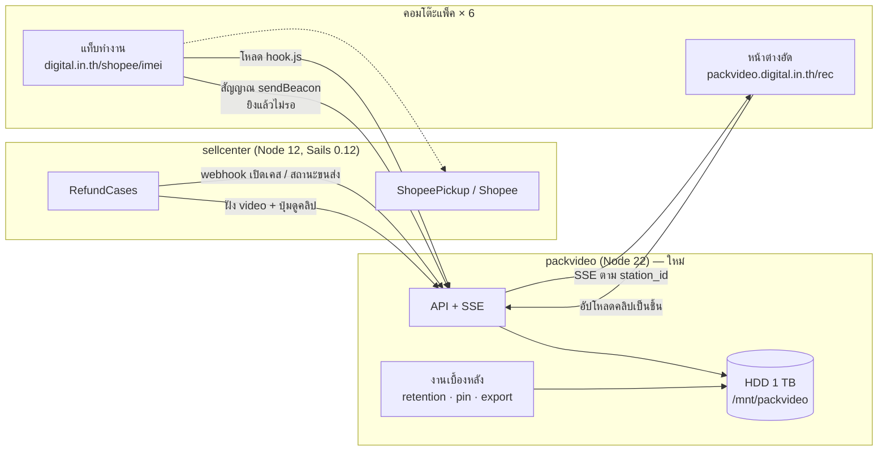
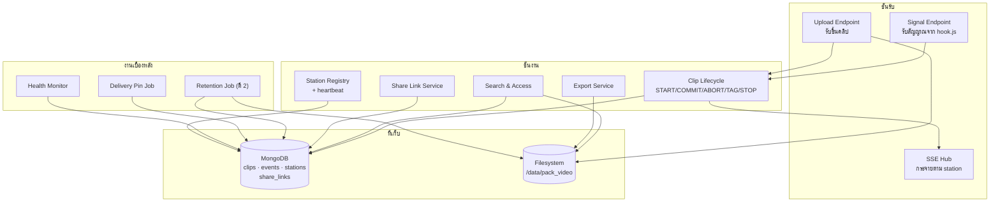
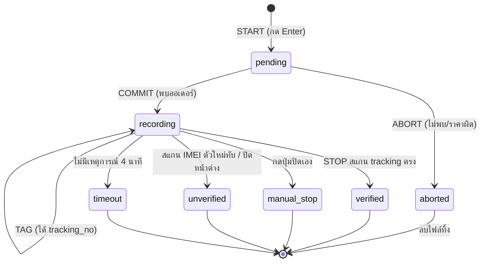
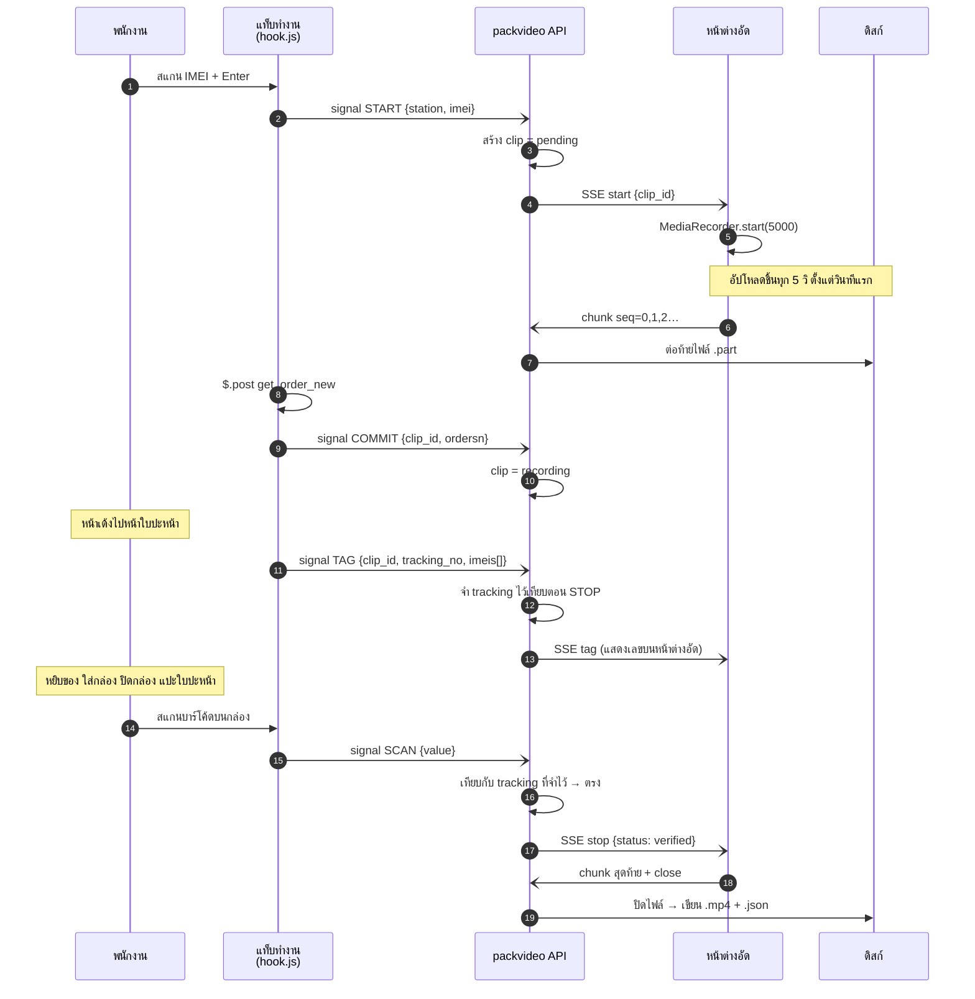
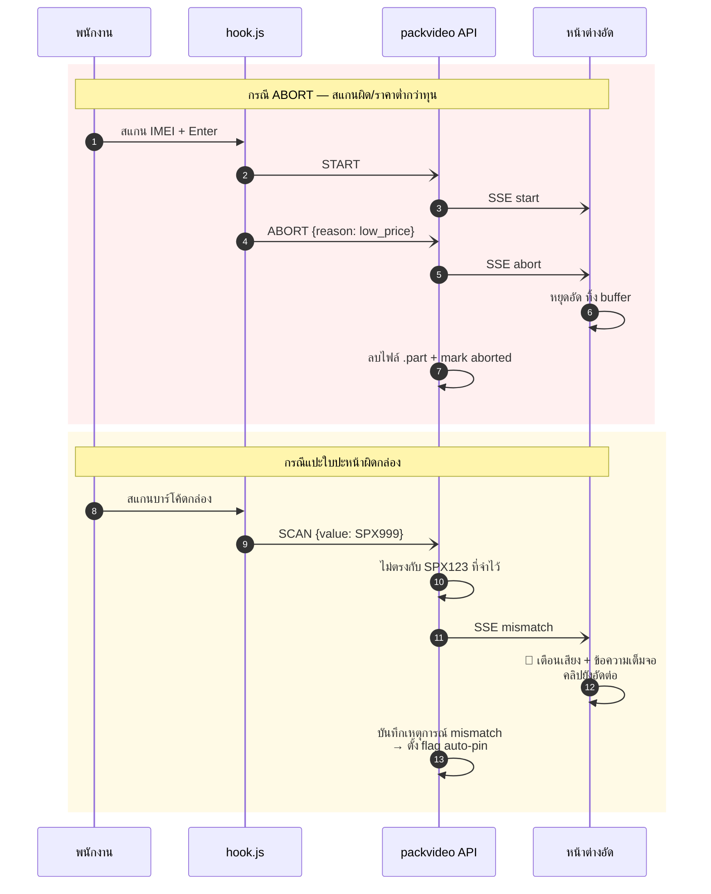
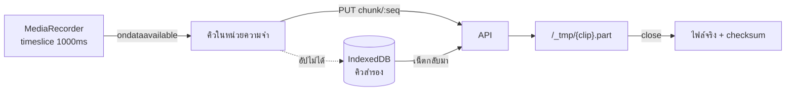
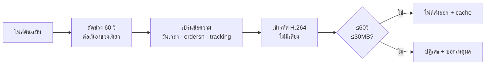
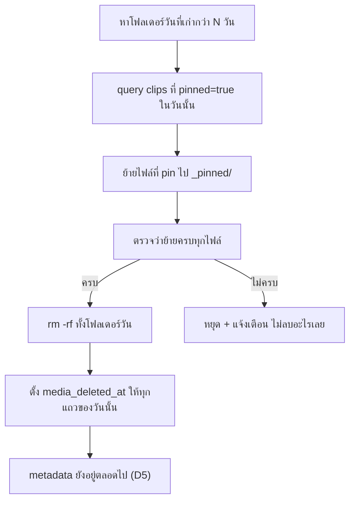

# Packing Video — เอกสารสถาปัตยกรรมและการออกแบบ

| | |
|---|---|
| สถานะ | ร่าง 1 — รอทบทวน |
| วันที่ | 2026-08-08 |
| ต้นทาง | [requirements.md](requirements.md) · [packing-video-design.md](../../sellcenter/docs/packing-video-design.md) |
| ไม่รวม | โค้ดจริง → `/sc:implement` |

---

## 0. สรุปการตัดสินใจเชิงออกแบบ

ตารางนี้คือสิ่งที่ต้องอ่านถ้าจะอ่านแค่หน้าเดียว — 6 ข้อแรกต่างจากที่ design doc เดิมวางไว้

| # | การตัดสินใจ | ทำไม | ต่างจากเดิม |
|---|---|---|---|
| **D1** | `hook.js` เกาะกับ **การเรียก AJAX** ไม่ใช่ DOM id | หน้าเดิมใช้ jQuery 3.3.1 ดักที่ `ajaxSend`/`ajaxSuccess` ของ `/shopee/imei/get_order_new` ได้เลย → ไม่ต้องพึ่ง `#txt_imei` หรือชื่อฟังก์ชัน `get_airway()` | ✅ แก้ความเสี่ยง "hook พังเงียบๆ" ที่ design doc §7 เตือนไว้เอง |
| **D2** ✔ | อัดเป็น **MP4/H.264 ตรงจากเบราว์เซอร์** ถ้ารองรับ | ไม่ต้อง transcode ตอนเก็บ — แปลงเฉพาะตอน export | ✅ ตัดความเสี่ยง "transcode 1,500 คลิป/วัน" ออกจาก critical path · **ยืนยันแล้วด้วย [S1](../spikes/s1-mediarecorder/RESULT.md)** |
| **D3** ✔ | **อัปโหลดเป็นชิ้น (chunk) ระหว่างอัด** ไม่ใช่ก้อนเดียวตอนจบ | FR-1.6 อัดยาวไม่จำกัด → ก้อนเดียวกินแรมและหายทั้งคลิปถ้าเบราว์เซอร์แครช | ✅ เรื่องที่เดิมไม่ได้คิด และจำเป็นเพราะ FR-1.6 · **ยืนยันแล้วด้วย [S1](../spikes/s1-mediarecorder/RESULT.md) — ตัดชิ้นท้ายแล้วไฟล์ยังเปิดได้** |
| **D4** | **metadata อยู่ในฐานข้อมูล ไม่ใช่ไฟล์ JSON ข้างคลิป** (แต่ยังเขียน JSON คู่ไว้ด้วย) | FR-4.1–4.3 ต้องค้นด้วย ordersn/tracking/imei จาก 45,000 คลิป — ไล่อ่านไฟล์ JSON ไม่ไหว | ✅ ปรับจาก design doc §6.2 |
| **D5** | **ลบเฉพาะไฟล์ ไม่ลบ metadata** | FR-4.8 ต้องตอบได้ว่า "เคยมี ลบเมื่อ…" ไม่ใช่ "ไม่พบ" · metadata 540k แถว/ปี = เล็กมาก | ✅ ทำให้ FR-4.8 แทบไม่มีต้นทุน |
| **D6** | ตัวหารของ health check มาจาก **สัญญาณ TAG ของเราเอง** | ทุกครั้งที่หน้าใบปะหน้าเรนเดอร์ hook ยิง TAG → นับใบปะหน้าที่พิมพ์ได้เองโดยไม่ต้องถามระบบเดิม | ✅ FR-2.4 ไม่ต้องต่อ API เพิ่ม |
| D7 | หน้าต่างอัดแยกจากหน้าทำงาน ไม่เคย navigate | flow เดิม redirect ตลอด MediaRecorder จะตาย | ตามเดิม |
| D8 | ส่งสัญญาณผ่านเซิร์ฟเวอร์ ไม่ใช่ `postMessage` | ต้องมองเห็นได้ว่าโต๊ะไหนไม่มีตัวอัด | ตามเดิม |
| D9 | แยกโปรเจกต์ Node 22 คนละ container | หนี Node 12 + ลิมิต 25 MB | ตามเดิม |

---

## 1. บริบทระบบ



**เส้นที่ต้องไม่มี:** `packvideo → sellcenter` แบบ synchronous ระหว่างการแพ็ค
ระบบใหม่ไม่เคยถามระบบเดิมตอนพนักงานกำลังทำงาน — ข้อมูลทั้งหมดถูกส่งมาให้แล้วผ่านสัญญาณ
(ยกเว้นงาน auto-pin จากสถานะขนส่ง ซึ่งเป็นงานกลางคืน ดู §9.3)

---

## 2. องค์ประกอบภายใน packvideo



**ทำไมใช้ MongoDB:** ระบบเดิมใช้อยู่แล้ว (`DBService.AggregateAll('wallet', ...)`)
ทีมคุ้นเคย และ metadata ของคลิปเป็นเอกสารอิสระไม่มี relation ซับซ้อน
**ใช้คนละ database** (`packvideo`) ไม่ปนกับ `wallet` — ล้อตามหลัก "แยกภาระ" ของ design doc §4.1

---

## 3. วงจรชีวิตของคลิป

### 3.1 สถานะ



| สถานะ | เก็บไฟล์ | auto-pin | นับใน % verified |
|---|---|---|---|
| `verified` | ✅ | – | ✅ ตัวตั้ง |
| `manual_stop` | ✅ | – | ❌ นับแยก (FR-1.10) |
| `unverified` | ✅ | ✅ FR-6.3 | ❌ |
| `timeout` | ✅ | ✅ FR-6.3 | ❌ |
| `aborted` | ❌ ลบ | – | ❌ ไม่นับเลย |

> **`manual_stop` ไม่ auto-pin** เพราะเป็นเหตุการณ์ปกติที่เกิดจากเครื่องพิมพ์ ไม่ใช่สัญญาณผิดปกติ
> ถ้า pin ด้วยจะทำให้ `_pinned/` โตเกินจริงและเสียความหมายของตัวชี้วัด

### 3.2 ลำดับเหตุการณ์ — ทางปกติ



**จุดที่ต้องระวัง — ลำดับ COMMIT กับ chunk แรก:**
`START` สร้าง `clip_id` และตอบกลับทันที แต่ `sendBeacon` **อ่านคำตอบไม่ได้**
หน้าต่างอัดจึงต้องได้ `clip_id` จาก SSE ไม่ใช่จากการตอบกลับของ hook
→ hook สร้าง **`trace_id` ฝั่ง client** (uuid) ส่งไปกับ START และใช้ `trace_id` เดิมอ้างอิงใน COMMIT/TAG
เซิร์ฟเวอร์แมป `trace_id → clip_id` เอง

### 3.3 ทางที่ผิดพลาด



**การเตือน mismatch แสดงที่หน้าต่างอัด ไม่ใช่แท็บทำงาน** — เพราะแท็บทำงานอาจกำลัง redirect
อยู่พอดี เตือนไปก็หายไปกับการโหลดหน้าใหม่ หน้าต่างอัดนิ่งตลอดเวลาจึงเป็นที่เดียวที่เตือนได้จริง
ต้องมีเสียงด้วยเพราะพนักงานกำลังก้มมองกล่อง ไม่ได้มองจอ

---

## 4. `hook.js` — สเปค

### 4.1 จุดเกาะ (D1)

หน้า `imei_new_api.ejs` โหลด jQuery 3.3.1 และเรียก `$.post("/shopee/imei/get_order_new", …)`
→ ดักที่ **global ajax event** ได้ทั้งหมดโดยไม่แตะโค้ดเดิมเลย

```js
// เชิงแนวคิด — ไม่ใช่โค้ดจริง
$(document).ajaxSend(function (e, xhr, opts) {
  if (!isTargetUrl(opts.url)) return;
  ctx.trace_id = uuid();
  beacon('start', { trace_id: ctx.trace_id, imei: parseField(opts.data, 'imei') });
});

$(document).ajaxSuccess(function (e, xhr, opts, data) {
  if (!isTargetUrl(opts.url)) return;
  beacon(decide(data), { trace_id: ctx.trace_id, ordersn: data.ordersn });
});
```

| ระดับ | เกาะกับอะไร | พังเมื่อ |
|---|---|---|
| **หลัก** | URL `/shopee/imei/get_order_new` + ฟิลด์ใน response | มีคนเปลี่ยน route หรือชื่อฟิลด์ — ซึ่ง design doc §7 ประกาศแล้วว่า **ไม่แตะ** |
| **สำรอง** | `keydown` capture-phase บน `#txt_imei` | เปลี่ยน id ของช่อง input |
| **ตรวจจับ** | health monitor §9.4 | ทั้งสองชั้นพร้อมกัน |

ทั้งสองชั้นทำงานพร้อมกันและ **กันซ้ำด้วย `trace_id`** — ยิงซ้ำในหน้าต่าง 2 วินาทีถือเป็นตัวเดียวกัน

> เดิม design doc §7 ระบุว่า hook เกาะกับ `#txt_imei` และตัวแปร `arr_tracking` แล้วเตือนเองว่า
> "ถ้ามีคนแก้หน้าเดิม hook อาจพังเงียบๆ" — การย้ายชั้นหลักไปเกาะ API contract แทน
> ทำให้ความเสี่ยงนั้นลดลงมาก เพราะ API contract คือสิ่งที่ทั้งเอกสารประกาศว่าจะไม่แตะอยู่แล้ว

### 4.2 หน้าใบปะหน้า

`airways_hot_test2.ejs` มี `arr_tracking.push("<%-tracking_no%>")` อยู่ inline ระหว่างเรนเดอร์
เพราะ `hook.js` โหลดแบบ `async` จึงรับประกันลำดับไม่ได้ → **อ่านหลัง `DOMContentLoaded`** ซึ่งตอนนั้น
`window.arr_tracking` ถูกเติมครบแล้วเสมอ

| ลำดับ | แหล่งของ `tracking_no` |
|---|---|
| 1 | `window.arr_tracking` |
| 2 | id ของ `<svg id="svg_{tracking_no}">` |
| 3 | ไม่พบ → ยิง TAG แบบไม่มี tracking + ขึ้น warning ใน health |

หน้านี้ยังมี `#txt_close` ที่ถูก `.focus()` อยู่แล้ว — ใช้เป็นช่องรับ STOP ได้ทันทีในกรณีที่
พนักงานปิดกล่องก่อนหน้าจะ redirect กลับ

### 4.3 หลักการที่ห้ามละเมิด

| ข้อ | เหตุผล |
|---|---|
| ต้องโหลดด้วย `async` | ไม่งั้นระบบใหม่ช้า = หน้าแพ็คช้า (NFR-1.1) |
| ทุกการเรียกใช้ห่อด้วย try/catch | hook พังต้องไม่ทำให้หน้าเดิมพัง |
| ใช้ `navigator.sendBeacon` เท่านั้น ไม่ใช้ `$.post` | ยิงแล้วไม่รอคำตอบ · form-encoded = simple request ไม่มี preflight |
| ห้ามแก้ DOM ของหน้าเดิม | ยกเว้นแถบสถานะเล็กมุมจอที่ `position:fixed` |
| ห้าม `alert`/`confirm` | บล็อกงานแพ็ค |
| `sendBeacon` คิวเต็ม/คืน false → ทิ้ง ไม่ retry | หน้ากำลังจะ navigate อยู่แล้ว retry ไม่มีประโยชน์ |

---

## 5. สัญญา API

### 5.1 ชั้นสัญญาณ — เรียกจากเบราว์เซอร์ของหน้าเดิม

```
POST /signal
Content-Type: application/x-www-form-urlencoded    ← simple request ไม่มี preflight
```

| ฟิลด์ | ตัวอย่าง | หมายเหตุ |
|---|---|---|
| `t` | station token | ขอบเขต `signal` เท่านั้น |
| `station_id` | `desk-03` | |
| `trace_id` | uuid v4 | สร้างฝั่ง client ใช้อ้างอิงข้ามสัญญาณ |
| `event` | `start` \| `commit` \| `abort` \| `tag` \| `scan` | |
| `imei` | `356938…` | เฉพาะ `start` |
| `ordersn` | `250808XXXX` | เฉพาะ `commit` |
| `reason` | `not_found` \| `low_price` \| … | เฉพาะ `abort` |
| `tracking_no` | `SPX123456789` | เฉพาะ `tag` |
| `imeis` | `a,b,c` | เฉพาะ `tag` |
| `value` | ค่าที่สแกน | เฉพาะ `scan` |
| `user` | ชื่อผู้ใช้จาก `#lblUser` | |

**ตอบกลับ `204 No Content` เสมอ** — ไม่มีอะไรให้อ่านอยู่แล้ว และ 204 เร็วที่สุด
ทุก error ถูกกลืนและบันทึกฝั่งเซิร์ฟเวอร์ **ห้ามตอบ 4xx/5xx** เพราะจะทำให้ browser console
ของหน้าแพ็คเต็มไปด้วย error ที่พนักงานเห็นแล้วตกใจ

> **การตัดสิน `scan` ว่าเป็น IMEI หรือ tracking ทำที่เซิร์ฟเวอร์** ไม่ใช่ที่ hook
> เพราะเป็น business logic ที่ต้องปรับจูนช่วง pilot — ตามหลัก "แก้ logic ได้โดยไม่ deploy sellcenter"

### 5.2 ชั้นหน้าต่างอัด — token ต่อโต๊ะ

| Endpoint | ทำอะไร |
|---|---|
| `GET /rec` | หน้าต่างอัด |
| `GET /api/stream/:station_id` | SSE — เหตุการณ์ `start` `commit` `abort` `tag` `stop` `mismatch` `config` `ping` |
| `PUT /api/clip/:clip_id/chunk/:seq` | อัปชิ้นวิดีโอ (binary) — idempotent ตาม `seq` |
| `POST /api/clip/:clip_id/close` | ปิดคลิป `{status, duration_ms, chunk_count}` |
| `POST /api/station/heartbeat` | ทุก 30 วินาที |

**SSE ส่ง `ping` ทุก 20 วินาที** เพื่อไม่ให้ nginx ตัดการเชื่อมต่อ (`proxy_read_timeout` ปริยาย 60 วิ)

**เหตุการณ์ `config`** ส่งค่า bitrate/ความละเอียด/timeout มาจากส่วนกลาง → FR-9.6 ทำได้โดย
ไม่ต้องไปตั้งทีละเครื่อง และปรับจูนช่วง pilot ได้ทันทีทุกโต๊ะพร้อมกัน

### 5.3 ชั้น CS / ผู้ดูแล — auth ด้วย session

| Endpoint | ทำอะไร | Req |
|---|---|---|
| `GET /api/clips?ordersn=&tracking=&imei=&from=&to=&station=&packer=&status=` | ค้นหา | FR-4.1–4.3, 4.7 |
| `GET /api/clips/:id` | รายละเอียด + สถานะ + เหตุการณ์ | FR-4.6 |
| `GET /media/:id?sig=&exp=` | สตรีมวิดีโอ **รองรับ Range → 206** | FR-4.5 |
| `POST /api/clips/:id/export` `{start_ms, duration_ms}` | สร้างไฟล์ส่งออก | FR-5.1, 5.2, 5.5, 5.7 |
| `GET /api/clips/:id/frame?t=&n=` | ดึงเฟรมนิ่ง (สูงสุด 6) | FR-5.3 |
| `GET /api/clips/:id/cover` | รูปปกสำหรับ Lazada | FR-5.4 |
| `POST /api/clips/:id/pin` `{reason}` · `DELETE` | pin / ถอน pin | FR-6.2, 6.5 |
| `POST /api/clips/:id/share` `{expires_at}` | สร้างลิงก์ภายนอก | FR-5.9, 5.10 |
| `DELETE /api/share/:token` | ยกเลิกลิงก์ | FR-5.10 |
| `GET /api/clips/:id/access-log` | ใครดู/ดาวน์โหลด/แชร์ไปแล้วบ้าง | FR-5.8, 5.11, NFR-4.7 |
| `GET /api/health` | สถานะรวม | FR-9.4 |
| `GET /api/stations` · `POST /api/stations/:id` | ทะเบียนโต๊ะ | FR-9.1, 9.2 |

### 5.4 ชั้น webhook — จาก sellcenter (service token)

| Endpoint | ทำอะไร | Req |
|---|---|---|
| `POST /api/hook/case-opened` `{ordersn, tracking_no, case_id, platform}` | pin คลิป | FR-6.1 |
| `POST /api/hook/delivery-status` `{tracking_no, status}` | pin เมื่อของหาย/ตีกลับ | FR-6.4 |

### 5.5 ชั้นสาธารณะ

| Endpoint | ทำอะไร |
|---|---|
| `GET /hook.js` | สคริปต์ที่หน้าเดิมโหลด — `Cache-Control: max-age=300` |
| `GET /s/:token` | หน้าเล่นคลิปสำหรับบุคคลภายนอก (A5) |

**`/s/:token` เสิร์ฟหน้า HTML ไม่ใช่ไฟล์ดิบ** — ควบคุมได้ว่าจะโหลดคลิปไหน บันทึกการเข้าดู
และใส่ข้อความกำกับได้ · ตัววิดีโอโหลดผ่าน URL ชั่วคราวที่ผูกกับ token นั้นเท่านั้น

---

## 6. โครงสร้างข้อมูล

### 6.1 `clips` — เอกสารหลัก

| ฟิลด์ | ชนิด | หมายเหตุ |
|---|---|---|
| `_id` | string | clip id — ใช้เป็นชื่อไฟล์ด้วย |
| `trace_id` | string | อ้างอิงจาก hook |
| `station_id` | string | |
| `packer` | string | จาก `#lblUser` |
| `status` | enum | ตาม §3.1 |
| `ordersn` | string \| null | **index** |
| `tracking_no` | string \| null | **index** |
| `imeis` | string[] | **index** |
| `started_at` / `ended_at` | Date | |
| `duration_ms` | int | |
| `bytes` | int | |
| `media_path` | string | path สัมพัทธ์จาก root |
| `media_deleted_at` | Date \| null | **ตั้งค่าแล้วไฟล์หาย แต่แถวยังอยู่ (D5)** |
| `checksum` | string | คำนวณตอนปิดไฟล์ → FR-7.5 |
| `pinned` | bool | |
| `pin_reasons` | string[] | `case_opened` \| `manual` \| `anomaly` \| `delivery` |
| `flags` | string[] | `mismatch` \| `cancelled` \| `no_tracking` |
| `day` | string | `2026-08-08` — ใช้จับคู่กับโฟลเดอร์ |

**index ที่ต้องมี:** `{ordersn}` · `{tracking_no}` · `{imeis}` · `{day, station_id}` · `{pinned, day}` · `{status, day}`

### 6.2 `clip_events` — append-only

ทุกเหตุการณ์ในชีวิตคลิป: `start` `commit` `abort` `tag` `scan` `mismatch` `close` `pin` `unpin`
`view` `download` `export` `share` `share_view` `delete`
พร้อม `actor`, `at`, `ip`, `detail` → รองรับ FR-7.6 และ NFR-4.7
**ห้ามมี endpoint ใดๆ ที่ลบหรือแก้ collection นี้**

### 6.3 `stations` · `share_links`

| `stations` | |
|---|---|
| `_id` | `desk-03` |
| `label` | "โต๊ะ 3" |
| `client_id` | uuid ของเบราว์เซอร์ที่ต่ออยู่ — ใช้กัน station ซ้ำ (FR-9.2) |
| `last_seen_at`, `connected`, `queue_depth`, `app_version` | |

| `share_links` | |
|---|---|
| `_id` | token สุ่ม 128 บิต |
| `clip_id`, `created_by`, `created_at`, `expires_at`, `revoked_at` | |
| `view_count`, `last_viewed_at` | FR-5.11 |
| `note` | "ส่งให้ Flash เคลม #123" |

### 6.4 ไฟล์บนดิสก์

```
/data/pack_video/
  2026/08/08/
    c_01J8X4…mp4          ← ไฟล์ต้นฉบับ ห้ามแก้ (FR-7.4)
    c_01J8X4….json        ← สำเนา metadata แบบอ่านเองได้
  _pinned/
    c_01J7A2….mp4
    c_01J7A2….json
  _export/                ← cache ผลลัพธ์ export ลบได้ทุกเมื่อ
    c_01J8X4…_0_60000.mp4
  _tmp/                   ← ไฟล์ .part ระหว่างอัด
```

**เขียน JSON คู่ไว้แม้ metadata หลักอยู่ใน DB** — ถ้าฐานข้อมูลหาย ไฟล์ยังบอกตัวเองได้ว่าเป็นของ
ออเดอร์ไหน ซึ่งเป็นคุณสมบัติที่หลักฐานควรมี · DB คือ index, ไฟล์คือความจริง

---

## 7. การอัดและการอัปโหลด

### 7.1 เลือกฟอร์แมต (D2)

```
ลำดับความชอบ:
1. video/mp4;codecs=avc1.42E01E    ← ได้เลย ไม่ต้องแปลง
2. video/webm;codecs=vp9
3. video/webm;codecs=vp8
```

ตรวจด้วย `MediaRecorder.isTypeSupported()` ตอนเปิดหน้าต่างอัด แล้วรายงานขึ้น `stations.app_version`
ถ้าได้ (1) → ไฟล์ต้นฉบับเป็น MP4 ใช้ได้เลยทั้งการเล่นและการส่งออก
ถ้าได้ (2)/(3) → ตั้งคิวแปลงเป็น MP4 **ตอนกลางคืน** ไม่ใช่ตอนอัด

> ✔ **ยืนยันแล้วด้วย [S1](../spikes/s1-mediarecorder/RESULT.md)** — ได้ทางเลือก (1)
> งานแปลงไฟล์จึงย้ายออกจากเส้นทางหลักทั้งหมด ความเสี่ยง "transcode 1,500 คลิป/วัน"
> ใน design doc §9 ตัดออกได้ · ffmpeg ยังต้องมี แต่ใช้เฉพาะตอนส่งออกหลักฐาน
> ซึ่งเกิดเฉพาะเคสที่มีข้อพิพาทจริง (<1% ของออเดอร์)
>
> ยังต้องตรวจซ้ำบนเครื่องโต๊ะแพ็คทุกเครื่องตอนติดตั้ง เพราะ S1 รันบนเครื่องเดียว —
> หน้าต่างอัดรายงานผลตรวจขึ้น `stations.app_version` ให้อยู่แล้ว

### 7.2 อัปโหลดเป็นชิ้น (D3)



| เรื่อง | การออกแบบ |
|---|---|
| **`timeslice` ที่ขอ** | **1000 ms** — ไม่ใช่ 5000 ms ดูกล่องด้านล่าง |
| จังหวะที่ได้จริง | ~2–4 วินาที ≈ 0.25–0.5 MB ที่ 1.0 Mbps (วัดจาก S1) |
| ต่อชิ้นได้เลย | MediaRecorder ผลิต fragmented stream ต่อท้ายกันได้ตรงๆ — **ยืนยันแล้วด้วย S1** |
| อัปซ้ำ | `PUT` ตาม `seq` — ยิงซ้ำได้ ไม่เกิดข้อมูลซ้อน |
| เน็ตขาด | คิวลง IndexedDB ทนได้ ≥ 10 นาที (NFR-1.4) |
| แครชกลางคลิป | เสียเฉพาะชิ้นสุดท้าย **≤ ~4 วินาที** ไม่ใช่ทั้งคลิป — S1 ยืนยันว่าไฟล์ที่ขาดชิ้นท้ายยังเปิดได้ |

> **ทำไมขอ 1000 ms ทั้งที่อยากได้ชิ้นใหญ่กว่านั้น**
> `timeslice` เป็นคำขอ ไม่ใช่สัญญา — S1 ขอทุก 1 วินาที แต่เบราว์เซอร์ส่งจริงห่างได้ถึง **4.06 วินาที**
> เพราะรวบตามขอบเขต fragment ของ MP4 เอง การขอ 5000 ms จึงได้ช่วงห่าง ≥5 วินาที
> โดยไม่ได้อะไรกลับมา · ขอถี่กว่าที่ต้องการ = worst case ของการสูญเสียต่ำลงฟรีๆ
> เพราะเบราว์เซอร์รวบชิ้นให้เองอยู่แล้ว
| หน่วยความจำ | คงที่ ไม่โตตามความยาวคลิป — จำเป็นเพราะ FR-1.6 |
| คิวค้าง | `queue_depth` ส่งขึ้นทุก heartbeat → แสดงบนหน้าต่างอัดและหน้า monitor (FR-1.13, 8.1) |

### 7.3 หน้าต่างอัด

```
┌────────────────────────────────┐
│  โต๊ะ 3          ● กำลังอัด 0:42 │
│ ┌────────────────────────────┐ │
│ │      พรีวิวกล้อง            │ │
│ └────────────────────────────┘ │
│  ออเดอร์  250808XXXXXXX        │
│  พัสดุ     SPX123456789         │
│  รอสแกนปิด…          [ ปิดเอง ] │
│  คิวรออัปโหลด 2 · ดิสก์ 62%     │
└────────────────────────────────┘
```

- ไม่มีลิงก์ที่กดแล้ว navigate ออกจากหน้านี้ได้เลย — ทุกอย่างเปิดแท็บใหม่
- `beforeunload` เตือนเมื่อยังมีคลิปค้างหรือคิวยังไม่ว่าง
- Wake Lock กันจอดับระหว่างกะ
- ปุ่ม "ปิดเอง" (FR-1.10) วางห่างจากขอบและต้องกดค้าง 1 วินาที — กันกดโดนตอนหยิบของ

---

## 8. การส่งออกหลักฐาน

### 8.1 ข้อจำกัดที่ออกแบบรอบมัน

จาก [RefundCaseActionService.js:987](../../sellcenter/api/services/RefundCaseActionService.js) —
`{ image_mb: 10, video_mb: 30, video_sec: 60 }`, รับ MP4/MOV/JPG/JPEG/PNG

**ตัวที่บีบจริงคือ 60 วินาที ไม่ใช่ 30 MB** — ต้นฉบับ 1.0 Mbps × 60 วิ ≈ 7.5 MB ห่างจากเพดาน 30 MB มาก
เพราะฉะนั้น export สามารถ**คงคุณภาพต้นฉบับไว้ทั้งหมด** ไม่ต้องบีบซ้ำ

### 8.2 ท่อการทำงาน



| ข้อ | การออกแบบ |
|---|---|
| FR-5.5 ช่วงเดียวต่อเนื่อง | UI รับได้แค่ `start_ms` ตัวเดียว — **โครงสร้าง API ไม่เปิดช่องให้ต่อหลายช่วงได้เลย** |
| FR-5.6 ช่วงเริ่มต้น | ถอยหลัง 60 วิ จากเวลาที่เกิดเหตุการณ์ `scan` สำเร็จ = ช่วงที่มีทั้งการปิดกล่องและเลขพัสดุ |
| FR-5.7 เบิร์นข้อความ | มุมบน: วันเวลาแบบเต็ม · มุมล่าง: `ordersn` + `tracking_no` · พื้นทึบใต้ตัวอักษรให้อ่านออกทุกพื้นหลัง |
| cache | key = `clip_id + start_ms + duration_ms` → กดซ้ำได้ทันที · ลบทิ้งได้ทุกเมื่อ |
| FR-5.3 เฟรมนิ่ง | ดึงจากไฟล์ต้นฉบับ เบิร์นข้อความชุดเดียวกัน สูงสุด 6 รูป |
| FR-5.4 รูปปก | เฟรมที่วินาทีที่ 1 ของช่วงที่เลือก + URL ถาวรตราบใดที่คลิปยังอยู่ |
| FR-5.8 | ทุกครั้งที่ export/download เขียน `clip_events` |

**ข้อจำกัดที่ยอมรับ:** คลิปที่ยาวกว่า 60 วินาทีมากๆ (เช่น 3 นาที) จะส่งได้แค่ 1 ใน 3 ของเหตุการณ์
ถ้าตัวเลข p95 จาก pilot สูงกว่า 90 วินาที ต้องกลับไปคุยเรื่อง**ขั้นตอนหน้างาน**
ไม่ใช่แก้ที่ระบบ — เพราะ 60 วินาทีเป็นเพดานของแพลตฟอร์มที่เราเปลี่ยนไม่ได้

---

## 9. งานเบื้องหลัง

### 9.1 Retention (ตี 2)



**ขั้น D สำคัญที่สุด** — ถ้าย้ายไฟล์ที่ pin ไม่ครบแล้วยัง `rm -rf` ต่อ = ทำลายหลักฐานของเคสที่กำลังสู้เงินอยู่
งานนี้ต้องออกแบบให้ **ยอมไม่ลบดีกว่าลบผิด** และแจ้งเตือนทันทีเมื่อไม่แน่ใจ

### 9.2 กันดิสก์เต็ม

| ระดับ | เกิดอะไร |
|---|---|
| 75% | แจ้ง Telegram (FR-3.4) |
| 85% | บีบ retention ลงชั่วคราวและแจ้งซ้ำ |
| 90% | ส่ง `config {recording: false}` ทาง SSE → หน้าต่างอัดขึ้นแดง "ดิสก์เต็ม ไม่ได้บันทึก" **แต่ `/signal` ยังรับปกติ งานแพ็คเดินต่อ** (FR-3.5) |
| ทุกระดับ | `_pinned/` ไม่ถูกแตะ (FR-6.6) |

> ระบบเดิมมี Telegram อยู่แล้วใน [NotifyService.js](../../sellcenter/api/services/NotifyService.js)
> — ⚠️ ไฟล์นั้น **hardcode bot token ไว้ในซอร์ส** ระบบใหม่ต้องอ่านจาก env เท่านั้น ห้ามทำตาม

### 9.3 Auto-pin จากสถานะขนส่ง (FR-6.4)

งานกลางคืน: ถาม sellcenter ว่ามี `tracking_number` ไหนที่สถานะเป็นของหาย/ตีกลับ ในช่วง 30 วัน
→ pin คลิปที่ตรงกัน
**เป็นทิศทางเดียวและเป็นงานกลางคืน** — ไม่มีการเรียกข้ามระบบระหว่างเวลาทำงาน
งานนี้ยังไม่มีในแผนเวลาเดิม (requirements §8 ข้อ 3) — ทำหลัง pilot ได้โดยไม่กระทบส่วนอื่น

### 9.4 Health Monitor (D6)

| ตัวชี้วัด | สูตร | เตือนเมื่อ |
|---|---|---|
| อัตราคลิปต่อใบปะหน้า | `clips(commit) / signals(tag)` รายชั่วโมงรายโต๊ะ | < 0.95 |
| โต๊ะที่พิมพ์ใบปะหน้าแต่ไม่มีตัวอัด | มี `tag` แต่ `stations.connected = false` | ทันที (FR-8.2) |
| hook เงียบทั้งระบบ | ไม่มี signal ใดๆ > 15 นาที ในเวลาทำงาน | ทันที |
| คิวอัปโหลดค้าง | `queue_depth > 20` | 10 นาที |

**ตัวหารมาจากสัญญาณ TAG ของเราเอง** — ทุกครั้งที่หน้าใบปะหน้าเรนเดอร์คือใบปะหน้า 1 ใบเสมอ
จึงนับได้โดยไม่ต้องต่อ API เข้าระบบเดิม และถ้า hook พังทั้งตัว ตัวหารจะเป็น 0 พร้อมกับตัวตั้ง
→ ต้องมีสัญญาณ "hook เงียบทั้งระบบ" มาปิดช่องโหว่นี้

---

## 10. ความปลอดภัย

### 10.1 สามชนิดของสิทธิ์

| ชนิด | ใครถือ | ทำอะไรได้ | อายุ |
|---|---|---|---|
| **station token** | อยู่ในหน้าเว็บของโต๊ะ — ถือว่าเปิดเผย | `signal` + อัปโหลดของโต๊ะตัวเอง · **อ่านคลิปไม่ได้เลย** | หมุนเวียนได้ |
| **service token** | sellcenter ฝั่งเซิร์ฟเวอร์ | webhook | หมุนเวียนได้ |
| **session ผู้ใช้** | A2 A3 A4 | ตามบทบาท | ตามระบบเดิม |

**station token อ่านคลิปไม่ได้ คือหัวใจ** — token ตัวนี้อยู่ในหน้าเว็บที่ใครก็เปิด view-source ได้
ถ้ามันอ่านคลิปได้ = คลิปทั้งคลังรั่ว จึงออกแบบให้เขียนได้อย่างเดียวและเขียนได้เฉพาะโต๊ะตัวเอง

ทำตาม pattern ของ [ServiceTokenService](../../sellcenter/api/services/ServiceTokenService.js) ที่มีอยู่แล้ว
(`generate` / `rotate` / `revoke` / `activate` + `scopes[]` + `tokenPrefix`) — ทีมคุ้นอยู่แล้ว

### 10.2 การเข้าถึงคลิป

| ทาง | กลไก | อายุ |
|---|---|---|
| หน้าเคส RefundCases ฝัง `<video>` | signed URL — HMAC ของ `clip_id + exp` | 15 นาที |
| CS ดาวน์โหลด | session + บันทึก event | ต่อครั้ง |
| ลิงก์ภายนอก A5 | token สุ่ม 128 บิต + ตรวจ `expires_at` และ `revoked_at` ทุกครั้ง | ตั้งได้ ปริยาย 7 วัน |

- ตรวจ `revoked_at` **ทุก request** ไม่ใช่แค่ตอนเปิดหน้า — ไม่งั้นยกเลิกลิงก์แล้วคนที่เปิดค้างไว้ยังดูต่อได้
- `clip_id` ต้องเป็นค่าสุ่มที่เดาไม่ได้ ไม่ใช่เลขวิ่ง (NFR-3.6)
- rate limit ที่ `/s/:token` และ `/media/:id` กันไล่เดา
- ไม่มี endpoint ไหนคืนรายการคลิปให้ผู้ที่ไม่มี session

### 10.3 CORS

```
Access-Control-Allow-Origin: https://digital.in.th     ← ระบุตรงๆ ไม่ใช้ *
```
`/signal` เป็น form-encoded → simple request ไม่มี preflight (ตาม design doc §4.3)
`/hook.js` เสิร์ฟเป็นไฟล์ static ธรรมดา ไม่ต้องมี CORS

---

## 11. การติดตั้ง

### 11.1 Container

```yaml
# packvideo — คนละ container คนละ image กับ sellcenter
services:
  packvideo:
    image: packvideo:latest
    environment:
      NODE_ENV: production
      PACK_VIDEO_PATH: /data/pack_video     # ล้อ convention FILESTORE_PATH ของเดิม
      MONGO_URL: ...                        # database ชื่อ packvideo
      RETENTION_DAYS: 30
      DISK_WARN_PCT: 75
      DISK_STOP_PCT: 90
      TELEGRAM_BOT_TOKEN: ...               # จาก env เท่านั้น
    volumes:
      - /mnt/packvideo:/data/pack_video     # HDD 1TB ลูกที่ว่าง
    ports:
      - "1338:1338"
    restart: unless-stopped
    networks: [sellcenter-network]          # ใช้ network เดิม
```

### 11.2 nginx

server block ใหม่สำหรับ `packvideo.digital.in.th` — SSL จัดการที่ nginx เหมือนเดิม
([config/env/production.js:24](../../sellcenter/config/env/production.js))

| จุด | ต้องตั้ง | ทำไม |
|---|---|---|
| `/api/stream/` | `proxy_buffering off` · `proxy_read_timeout 1h` | SSE จะถูกตัดถ้าไม่ตั้ง |
| `/api/clip/*/chunk` | `client_max_body_size 8m` | ชิ้นละ ~0.6 MB มีที่เหลือเฟือ |
| `/media/` | ส่ง Range ผ่านไปตรงๆ | ต้องได้ 206 ไม่งั้นเลื่อนกลางคลิปไม่ได้ |
| ทั้ง vhost | HTTPS เท่านั้น | `getUserMedia` ไม่ทำงานบน http (NFR-3.4) |

**ไม่มีลิมิต 25 MB ของ `config/http.js`** เพราะเป็นคนละ process — แต่ถึงมีก็ไม่ติด
เพราะอัปเป็นชิ้นละ 0.6 MB อยู่แล้ว (D3)

---

## 12. พฤติกรรมเมื่อระบบพัง

หลักการเดียว: **ระบบวิดีโอพังได้ งานแพ็คห้ามหยุด** (NFR-1.1)

| อะไรพัง | หน้าแพ็ค | การอัด | ใครรู้ | คลิปที่มีอยู่ |
|---|---|---|---|---|
| packvideo ล่มทั้งตัว | ปกติ | ไม่อัด | health + Telegram | ปลอดภัย |
| `hook.js` โหลดไม่ได้ | ปกติ (`async`) | ไม่อัด | "hook เงียบทั้งระบบ" | ปลอดภัย |
| พนักงานปิดหน้าต่างอัด | ปกติ | โต๊ะนั้นไม่อัด | FR-8.2 เตือนภายใน 5 นาที | คลิปค้าง → `unverified` |
| เน็ตขาดชั่วคราว | ปกติ | อัดต่อ เข้าคิว | `queue_depth` | อัปเมื่อเน็ตกลับ |
| ดิสก์เต็ม 90% | ปกติ | หยุดอัด | แถบแดง + Telegram | `_pinned/` ไม่ถูกแตะ |
| MongoDB ล่ม | ปกติ | หยุดอัด | health | ไฟล์ + JSON คู่ยังอยู่ |
| กล้องหลุด/ถูกถอด | ปกติ | โต๊ะนั้นไม่อัด | หน้าต่างอัดขึ้นแดงทันที | ปลอดภัย |
| ไฟดับ | – | – | – | เสีย ≤5 วินาทีสุดท้ายของคลิปที่ค้าง |

---

## 13. ตารางสอบทานกับความต้องการ

| กลุ่ม | ครอบคลุมที่ | หมายเหตุ |
|---|---|---|
| FR-1 การบันทึก | §3, §4, §7 | FR-1.10 ปุ่มปิดเอง → §7.3 |
| FR-2 ผูกข้อมูล | §3.2, §4, §6.1 | FR-2.4 → §9.4 |
| FR-3 จัดเก็บ/retention | §6.4, §9.1, §9.2 | |
| FR-4 ค้นหา | §5.3, §6.1 | FR-4.8 → D5 |
| FR-5 ส่งออก | §8 | ทุกข้อ |
| FR-6 pin | §9.1, §9.3, §5.4 | FR-6.4 ยังไม่มีในแผนเวลา |
| FR-7 น่าเชื่อถือ | §6.1 `checksum`, §6.2 | FR-7.1–7.3 เป็นเรื่องกล้อง/แสง ไม่ใช่ซอฟต์แวร์ |
| FR-8 กำกับหน้างาน | §9.4 | |
| FR-9 ตั้งค่า/ดูแล | §5.2 `config`, §6.3 | FR-9.6 → SSE `config` |
| NFR-1 ไม่กระทบงานแพ็ค | §4.3, §12 | |
| NFR-2 พื้นที่ | §7.1, §9.2 | ค่า bitrate ยังต้องยืนยันด้วยตา |
| NFR-3 ปลอดภัย | §10 | |
| NFR-4 PDPA | §6.2, §10.2 | NFR-4.6 เป็นงานเอกสาร ไม่ใช่ซอฟต์แวร์ |
| NFR-5 ดูแลระบบ | §9.4, §11 | |

**ที่ยังไม่ได้ออกแบบโดยตั้งใจ** — รอผลจาก pilot
- ค่า bitrate สุดท้าย (requirements §8 ข้อ 8)
- อายุลิงก์แชร์ปริยาย (§8 ข้อ 5)
- รูปแบบและกำหนดเวลาของงาน auto-pin จากขนส่ง (§8 ข้อ 3)

---

## 14. ลำดับการทำ

| เฟส | ส่งมอบอะไร | ทำไมลำดับนี้ |
|---|---|---|
| **1** | ทะเบียนโต๊ะ · `/signal` · `clips` + `clip_events` · หน้าค้นหา | สร้าง index ของเหตุการณ์แพ็คได้ก่อน **โดยยังไม่มีกล้องสักตัว** — พิสูจน์ D1 (hook เกาะติดไหม) และ D6 (ตัวหาร health ถูกไหม) ด้วยข้อมูลจริง ก่อนซื้อของ |
| **2a** | หน้าต่างอัด · อัปเป็นชิ้น · SSE · pilot 1 โต๊ะ | ทดสอบ D2 (เบราว์เซอร์อัด MP4 ได้ไหม) และ D3 กับของจริง |
| **2b** | รันคู่ขนาน เก็บ p50/p95 ความยาวคลิป ปรับ bitrate | ตัวเลขที่ NFR-2 รออยู่ |
| **2c** | export · share link · pin · retention · ต่อ RefundCases · ขยาย 6 โต๊ะ | ทำหลังจากรู้แล้วว่าคลิปใช้ได้จริง |

**เฟส 1 คุ้มค่าแม้โครงการถูกยกเลิก** — ได้ข้อมูลว่าออเดอร์ไหนแพ็คที่โต๊ะไหนโดยใคร
ซึ่งตอนนี้ไม่มีเลย (เป้าหมาย G4) และเป็นสิ่งที่ระบบหลักฐานทุกแบบต้องใช้

---

## 15. ขั้นตอนถัดไป

1. ทบทวน §0 โดยเฉพาะ D1–D6
2. ~~ยืนยัน D2~~ ✔ **ปิดแล้ว** — [S1 ผ่าน](../spikes/s1-mediarecorder/RESULT.md) ทั้ง D2 และ D3
3. เหลือสมมติฐานที่ยังไม่ยืนยัน: **D1** (hook เกาะ AJAX ติดไหม → ปิดที่ Gate 1)
   และ **D6** (ตัวหาร health ถูกไหม → ปิดที่ Gate 1)
4. ลงมือตาม [แผน](../claudedocs/workflow_packvideo.md) — เริ่มที่ P1-1
